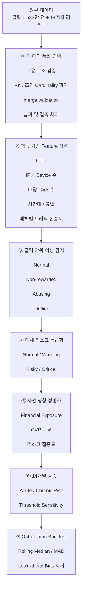

# IVE Korea — 리워드 광고 플랫폼 이상 트래픽 탐지 및 리스크 분석


국내 리워드형 모바일 광고 플랫폼의 **클릭 이벤트 1,683만 건**과 **14개월 성과 데이터**를 분석해 이상 트래픽을 탐지하고, 매체별 리스크와 잠재 재무 노출 규모를 정량화한 프로젝트입니다.

정답 라벨이 없는 환경에서 5개의 행동 가설을 기반으로 이상 탐지 기준을 설계하고, 클릭 단위 탐지 결과를 매체 단위 리스크 등급으로 연결했습니다. 이후 14개월 과거 데이터와 Out-of-Time 백테스트를 활용해 탐지 결과가 단순한 사후 설명에 그치지 않는지도 검증했습니다.

> 본 저장소는 **데이터 통합 → 이상 트래픽 탐지 → 리스크 정량화 → 과거 데이터 검증**까지 제가 직접 수행한 영역을 중심으로 구성했습니다.
> 매체 운영 관리 및 도메인별 광고 최적화는 팀원이 담당했으며, 전체 프로젝트 흐름을 설명하는 범위에서만 간략히 포함했습니다.

---

## 1. 프로젝트 요약

| 항목         | 내용                                                      |
| ---------- | ------------------------------------------------------- |
| **문제**     | Invalid Traffic 정답 라벨 없이 광고 플랫폼의 이상 트래픽과 고위험 매체를 식별해야 함 |
| **데이터**    | 클릭 로그 16,831,054건 + 14개월 시간대별 성과 데이터                    |
| **대상**     | 광고 매체 189개                                              |
| **탐지 방식**  | CTIT, IP당 Device, IP당 Click, 트래픽 집중도, 시간대 패턴 기반 규칙형 탐지  |
| **리스크 등급** | Normal / Warning / Risky / Critical                     |
| **검증**     | 14개월 과거 데이터, 임계값 민감도 분석, Out-of-Time 백테스트               |
| **재무 분석**  | 이상 트래픽에 연결된 광고주 청구액 기준 Financial Exposure 산정            |
| **기술 스택**  | Python, Pandas, NumPy, Gemini 2.0 Flash API             |

### 핵심 결과

* 분석 클릭 **16,831,054건**
* 고신뢰 이상 트래픽 **6,387,902건 (38.0%)**
* 추가 모니터링 대상 **7,782,515건 (46.2%)**
* 저위험 잔여 트래픽 기준 CVR **8.74% → 30.50%**
* 고신뢰 이상 트래픽 재무 노출 규모 **약 6,708만원**
* 모니터링 대상 포함 총 재무 노출 규모 **약 2.61억원**
* 상위 2개 매체가 고신뢰 재무 노출액의 **75.5%**
* 189개 매체 중 **Critical 7 / Risky 12 / Warning 35 / Normal 135**

> 본 프로젝트에서는 이상 탐지 결과를 확정적인 Fraud 또는 실제 손실로 표현하지 않습니다.
> 정답 라벨이 없는 환경이므로 **High-confidence Anomaly**와 **Financial Exposure**라는 표현을 사용했습니다.

---

## 2. 문제 정의

리워드 광고 플랫폼에서는 짧은 시간 안에 대규모 클릭과 전환이 발생할 수 있습니다.

그러나 단순히 클릭 수나 CVR이 높다고 해서 정상 또는 비정상으로 판단할 수는 없습니다.

특히 본 데이터에는 다음과 같은 외부 정답 정보가 없었습니다.

* Invalid Traffic 확정 라벨
* 정산 거절 기록
* 운영자의 수작업 Fraud 판정
* 독립적인 Bot / Device Farm 정답 데이터

따라서 이 프로젝트의 목표를

> **“부정 트래픽을 확정한다”**

가 아니라,

> **“플랫폼 내부 행동 분포에서 통계적으로 이례적인 트래픽을 찾아 운영 우선순위를 정한다”**

로 정의했습니다.

---

## 3. 데이터

원본 데이터는 상업용 실무 데이터이므로 GitHub 저장소에는 포함하지 않습니다.

| 데이터                     | 설명          | 분석 단위             |
| ----------------------- | ----------- | ----------------- |
| `ad_catalog.csv`        | 광고 마스터      | 광고 캠페인 1건         |
| `ad_engagement.csv`     | 클릭 / 참여 로그  | 클릭 1건             |
| `ad_rewards.csv`        | 전환 및 리워드 로그 | 전환 이벤트 1건         |
| `hourly_report_1yr.csv` | 장기 성과 데이터   | 날짜 × 시간 × 광고 × 매체 |

### 분석 기간

| 데이터              | 기간                      |
| ---------------- | ----------------------- |
| 클릭 / 전환 / 광고 데이터 | 2025-07-26 ~ 2025-08-25 |
| 장기 시간대 성과 데이터    | 2024-07-27 ~ 2025-08-29 |

### 데이터 규모

* 클릭 이벤트: **16,831,054건**
* 분석 대상 매체: **189개**
* 장기 검증 기간: **14개월**

---

## 4. 분석 흐름



---

## 5. 데이터 품질 검증

1,600만 건 이상의 데이터를 병합하기 전에 구조적 오류가 이상 탐지 결과에 섞이지 않도록 데이터 품질을 먼저 검증했습니다.

### 비용 구조

플랫폼 비용은 다음 순서를 만족해야 합니다.

```text
show_cost
≥ adv_cost
≥ earn_cost
≥ rwd_cost
≥ 0
```

해당 관계를 위반하는 데이터는 분석 전에 제거했습니다.

### 조인 안정성 검증

대용량 데이터 병합 과정에서 의도하지 않은 행 증가가 발생하지 않도록 모든 주요 조인에 다음과 같은 검증을 적용했습니다.

```python
merge(validate=...)
```

또한:

* `click_key` 고유성
* `ads_idx` 고유성
* 조인 전후 행 수
* 중복 key

를 확인했습니다.

### 날짜 처리

광고 종료일 미정 광고에는 `9999-12-31` 값이 사용되고 있었습니다.

전체 광고의 **96.7%**가 해당 값을 포함하고 있어 날짜 타입 변환 전에 처리 가능한 값으로 변환했습니다.

### 전환 정의

전환 여부는 단순히 `ctit` 값의 존재 여부가 아니라 실제 **리워드 테이블에 이벤트가 존재하는지**를 기준으로 정의했습니다.

---

## 6. 5개 이상 트래픽 가설

정답 라벨이 없기 때문에 모델을 바로 학습시키는 대신 이상 행동이 어떤 형태로 나타날 수 있는지 가설을 먼저 세웠습니다.

| 가설     | 신호                    | 판단 논리                 |
| ------ | --------------------- | --------------------- |
| **H1** | Conversion Speed      | 비정상적으로 빠른 CTIT        |
| **H2** | Device Farm           | 하나의 IP에서 과도한 Device 수 |
| **H3** | Click Farm            | 하나의 IP에서 과도한 Click 수  |
| **H4** | Traffic Concentration | 특정 매체 / 광고에 이상 트래픽 집중 |
| **H5** | Temporal Pattern      | 일반 사용자와 다른 시간대·요일 행동  |

### H1 — Conversion Speed

광고 유형별 CTIT 중앙값을 기준으로 일반적인 전환 속도보다 지나치게 빠른 전환을 탐지했습니다.

Base Scenario에서는:

```text
CTIT < 광고 유형별 Median CTIT × 10%
```

을 주요 기준으로 활용했습니다.

### H2 — Device Farm

IP별 고유 Device 수의 상위 극단 구간을 탐지했습니다.

### H3 — Click Farm

IP별 Click 수가 전체 분포에서 극단적으로 높은 경우 자동화 또는 반복 참여 가능성이 있다고 판단했습니다.

### H4 — Traffic Concentration

H1~H3에서 발견된 이상 신호가 특정 매체에 집중되는지 확인했습니다.

### H5 — Temporal Pattern

정상 트래픽과 이상 트래픽의 시간대 및 요일 패턴을 비교했습니다.

---

## 7. 클릭 단위 이상 트래픽 분류

클릭은 다음 네 가지로 분류했습니다.

```text
normal
non_rewarded
abusing
outlier
```

분류 순서는 결과에 영향을 주기 때문에 명시적으로 관리했습니다.

```text
Outlier
   ↓
Abusing
   ↓
Non-rewarded
   ↓
Normal
```

`abusing`을 `non_rewarded`보다 먼저 처리한 이유는 IP 단위 이상 행동 때문입니다.

특정 클릭이 실제 전환으로 이어지지 않았더라도 해당 IP에서 비정상적으로 많은 Device 또는 Click이 발생했다면 이상 신호를 가지고 있을 수 있습니다.

---

## 8. 클릭 분류 결과

| 분류               |      클릭 수 |        비율 |
| ---------------- | --------: | --------: |
| **Outlier**      | 6,387,902 | **38.0%** |
| **Abusing**      | 7,782,515 | **46.2%** |
| **Non-rewarded** | 1,849,072 |     11.0% |
| **Normal**       |   811,565 |      4.8% |

전체 클릭 중 **38.0%가 고신뢰 이상 구간**, **46.2%가 추가 모니터링 대상으로 분류**되었습니다.

### 시각화


---

## 9. 매체 단위 리스크

클릭 단위 결과를 189개 매체별로 집계해 다음 네 단계로 구분했습니다.

```text
Critical
Risky
Warning
Normal
```

| 등급       | 매체 수 |
| -------- | ---: |
| Critical |    7 |
| Risky    |   12 |
| Warning  |   35 |
| Normal   |  135 |

등급은 각 매체의 `outlier` 및 `abusing` 비율을 기준으로 산정했습니다.

다만 현재 임계값은 휴리스틱 기준이므로 매체별 표본 크기의 차이는 충분히 반영하지 못합니다.

예를 들어:

> 클릭 4건 중 이상 비율 40%

와

> 클릭 100만 건 중 이상 비율 40%

은 동일한 비율이지만 통계적 신뢰 수준은 다릅니다.

이는 향후 Wilson Interval 또는 Beta-Binomial Shrinkage를 통해 개선할 수 있습니다.

---

## 10. 탐지 이후의 CVR

전체 플랫폼의 원시 CVR은:

**8.74%**

였습니다.

이상 트래픽을 제외하고 저위험 구간만 다시 계산하면:

**30.50%**

로 나타났습니다.

매체 리스크 등급별 CVR도 명확한 차이를 보였습니다.

| Risk     |       CVR |
| -------- | --------: |
| Normal   | **44.7%** |
| Warning  | **43.4%** |
| Risky    | **28.5%** |
| Critical |  **3.5%** |

이는 이상 탐지 결과가 단순히 클릭량만 나눈 것이 아니라 **전환 성과에서도 다른 특성을 가진 집단을 구분하고 있음을 보여주는 보조 근거**입니다.

다만 이를 “CVR이 8.74%에서 30.50%로 회복됐다”고 표현하지 않습니다.

정확한 표현은:

> **저위험으로 분류된 잔여 트래픽의 CVR이 30.50%였다.**

입니다.

### 시각화


---

## 11. Financial Exposure

이상 트래픽이 실제 광고주 비용과 얼마나 연결되어 있는지 확인하기 위해 `show_cost`를 기준으로 Financial Exposure를 계산했습니다.

| 구분      |         금액 |        비율 |
| ------- | ---------: | --------: |
| Normal  |    ₩316.5M |     54.8% |
| Abusing |    ₩193.6M |     33.5% |
| Outlier | **₩67.1M** | **11.6%** |

총 광고주 청구액은:

> **₩577,199,458**

이었습니다.

이 중:

* 고신뢰 이상 트래픽: **₩67,083,271**
* 모니터링 대상: **₩193,575,035**

이었습니다.

따라서 이상 신호와 연결된 전체 Financial Exposure는 약:

> **₩260.7M**

입니다.

이는 실제 손실액이 아니라 **이상 신호가 포함된 트래픽에 연결된 광고주 청구액**입니다.

### 재무 노출 집중도

고신뢰 이상 노출액은 특정 매체에 집중되어 있었습니다.

상위 **2개 매체가 전체 고신뢰 Financial Exposure의 75.5%**를 차지했습니다.

즉 전체 매체를 동일하게 관리하는 것보다 일부 고노출 매체를 먼저 조사하는 것이 운영상 효율적일 수 있습니다.

### 시각화


---

## 12. 14개월 과거 데이터 검증

31일 탐지 결과가 일시적인 현상인지 확인하기 위해 동일 매체의 과거 14개월 데이터를 분석했습니다.

중요한 점은 8월 탐지 모델에서 평가하지 않은 매체를 `normal`로 처리하지 않았다는 것입니다.

해당 매체는 별도로:

```text
unscored
```

로 유지했습니다.

14개월 데이터에서 `unscored` 매체는 전체 행의 **12.6%**였습니다.

평가되지 않은 매체를 정상으로 포함하면 실제 탐지 범위를 과장할 수 있기 때문입니다.

---

## 13. 급성 리스크 vs 만성 리스크

`risky / critical`로 분류된 19개 매체를 장기 트래픽 패턴에 따라 추가로 분류했습니다.

| 유형                     | 매체 수 | 특징              |
| ---------------------- | ---: | --------------- |
| **Acute Infiltration** |    1 | 최근 트래픽 급증       |
| **Chronic High-share** |    2 | 장기간 높은 트래픽 비중   |
| **Chronic Low-share**  |   16 | 낮은 수준의 이상 패턴 지속 |

중요한 결과는:

> **Financial Exposure가 가장 큰 매체가 Acute 유형이 아니라 Chronic High-share 유형이었다는 점**입니다.

따라서 위험 매체를 모두 동일한 방식으로 대응하는 것보다:

* Acute → 즉시 조사 / 제한
* Chronic High-share → 계약 / 단가 / 운영 구조 검토
* Chronic Low-share → 지속 모니터링

처럼 대응 우선순위를 다르게 설정할 수 있습니다.

---

## 14. Case Study — 매체 539

가장 명확한 이상 현상 중 하나는 매체 `539`였습니다.

약 13개월 동안 비교적 낮은 클릭 비중을 유지하다가 2025년 8월:

* 전체 플랫폼 Click Share: **79.76%**
* CVR: **0.08%**

까지 급격하게 변화했습니다.

이는 단순히 클릭량이 증가한 것이 아니라 **플랫폼 트래픽의 대부분이 하나의 매체로 집중되면서 전환 성과가 동시에 붕괴한 사례**였습니다.

### 시각화


이 사례를 기반으로 다음 질문을 추가했습니다.

> 이상 현상이 발생한 뒤 분석해서 찾는 것이 아니라, 실제 당시 데이터만 사용해 사전에 탐지할 수 있었을까?

---

## 15. Out-of-Time Backtest

메인 31일 분석에는 동일 기간 데이터를 이용해 임계값을 계산하는 과정이 포함되어 있습니다.

따라서 해당 결과를 그대로 사전 탐지 성능으로 해석하면 **Look-ahead Bias**가 발생합니다.

이를 보완하기 위해 30일 Rolling Median과 MAD를 사용했습니다.

```python
shift(1).rolling(30)
```

순서로 계산해 현재 시점의 데이터가 기준선 산정에 포함되지 않도록 했습니다.

즉 매일의 판단은:

> **그날 이전까지 실제로 관측할 수 있었던 데이터**

만 사용했습니다.

### 최초 알림 규칙

```text
Click Share z-score > 5
AND
CVR z-score < -3
```

### 결과

해당 조건은 실제 이상 기간을 포함해 **단 한 번도 발생하지 않았습니다.**

결과에 맞추어 임계값을 다시 조정하지 않고 Null Result를 그대로 보고했습니다.

원인을 확인한 결과:

* Click Share는 실제 이상 현상이 명확해지기 약 하루 전부터 임계값 초과
* CVR은 원래 변동성이 커서 극단적인 z-score를 기록하지 않음

즉 문제는 신호가 없었던 것이 아니라:

> **AND 조건이 너무 강해 실제 알림을 억제한 것**

이었습니다.

Click Share 단독 조건이었다면 약 하루의 지연을 두고 이상 현상을 탐지할 수 있었습니다.

---

## 16. 임계값 민감도 분석

이상 탐지 임계값은 절대적인 Fraud 기준이 아니라 분석자가 설정한 가정입니다.

따라서 세 가지 대표 시나리오를 비교했습니다.

| Scenario     |  CTIT | Extreme Percentile |
| ------------ | ----: | -----------------: |
| Conservative | ×0.05 |             99.95% |
| Base         | ×0.10 |             99.90% |
| Aggressive   | ×0.15 |             99.50% |

시나리오에 따라 이상 트래픽 비율은:

> **34.6% ~ 51.6%**

까지 변화했습니다.

그러나 Financial Exposure 기준 **상위 4개 매체의 순위는 세 시나리오 모두 동일하게 유지**됐습니다.

따라서:

* 이상 트래픽의 정확한 규모 → 임계값에 민감
* 가장 중요한 고위험 매체의 식별 → 상대적으로 안정적

이라는 결론을 얻었습니다.

---

## 17. 시간대 행동 패턴

H5에서는 정상 트래픽과 이상 트래픽의 시간대 및 요일 패턴을 비교했습니다.

이상 트래픽은 정상 트래픽보다 하루 전체에 걸쳐 높은 비율을 유지하는 경향을 보였습니다.

요일 패턴 역시 일부 고위험 매체에서 일반 트래픽과 다른 패턴이 나타났습니다.

다만 이 결과만으로 Bot 활동을 확정할 수는 없습니다.

따라서:

> **“자동화 행동과 일치하는 시간 패턴”**

이라는 수준에서 해석했습니다.

### 선택 시각화


---

## 18. 결과를 이렇게 표현한 이유

정답 라벨이 없는 상황에서 표현을 과도하게 확정적으로 사용하지 않았습니다.

| 사용하지 않은 표현               | 사용한 표현                                     |
| ------------------------ | ------------------------------------------ |
| Confirmed Fraud          | High-confidence Anomaly                    |
| Total Loss               | Financial Exposure                         |
| CVR Recovery             | Low-risk Remaining Traffic CVR             |
| Evidence of Bot Activity | Pattern Consistent with Automated Behavior |

예를 들어:

> “639만 건의 Fraud 클릭을 탐지했다.”

라고 쓰는 대신:

> **“플랫폼 행동 분포에서 639만 건의 고신뢰 이상 트래픽을 식별했다.”**

라고 표현합니다.

분석 결과의 설득력은 숫자를 강하게 표현하는 데서 나오는 것이 아니라, **그 숫자가 실제 데이터가 증명할 수 있는 범위를 넘지 않는 데서 나온다고 판단했습니다.**

---

## 19. 개인 기여

본 프로젝트에서 제가 직접 수행한 범위입니다.

### 데이터 엔지니어링 및 품질 검증

* 4개 데이터 소스 통합
* 1,683만 건 클릭 로그 전처리
* Primary Key 및 Join Cardinality 검증
* 비용 구조 검증
* 날짜 및 결측치 처리
* 전환 정의 재설계

### 이상 탐지

* CTIT 기반 빠른 전환 탐지
* IP당 Device 수 계산
* IP당 Click 수 계산
* 클릭 단위 Risk Classification
* 매체 단위 Risk Aggregation

### 비즈니스 리스크 분석

* Financial Exposure 산정
* 리스크 등급별 CVR 비교
* 고위험 매체 집중도 분석
* Acute / Chronic Risk 분류

### 검증

* 14개월 과거 데이터 비교
* `unscored` 매체 분리
* Threshold Sensitivity Analysis
* Rolling Median / MAD 기반 Out-of-Time Backtest
* Look-ahead Bias 제거
* Null Result 분석

### 팀원 담당

다음 영역은 팀원이 담당했습니다.

* 매체 운영 관리
* 광고주 Domain별 성과 분석
* 광고 유형 최적화

LLM 기반 광고 도메인 분류는 전체 프로젝트의 보조 과정으로 활용했습니다.

---

## 20. 알려진 한계

### 1. Ground Truth 부재

독립적으로 검증된 Invalid Traffic 라벨이 없습니다.

따라서 현재 탐지 결과는 Fraud 확정 판정이 아니라 **플랫폼 자체 행동 분포에서의 통계적 이상치**입니다.

### 2. 메인 분석의 Look-ahead Bias

31일 메인 탐지 기준은 분석 대상 기간 전체 분포를 사용했습니다.

따라서 사후 분석 용도로는 활용할 수 있지만 실시간 탐지 성능으로 해석할 수 없습니다.

Out-of-Time Backtest에서만 미래 정보 참조를 제거했습니다.

### 3. 매체 규모 보정 부족

현재 Risk Rating은 이상 트래픽 비율을 중심으로 산정했습니다.

매체별 클릭 수 차이에 대한 Confidence Interval이나 Shrinkage는 적용하지 않았습니다.

### 4. Domain Classification 검증 범위

규칙 + LLM 하이브리드 분류는 100건 표본 검수에서 **94% 일치**를 확인했지만 전체 데이터를 수작업으로 검증하지는 않았습니다.

### 5. Out-of-Time 검증 범위

Backtest는 대표적인 이상 사례 매체 1곳을 대상으로 수행했습니다.

플랫폼 전체 매체에 대한 실시간 탐지 성능 검증은 추가 작업이 필요합니다.

---

## 21. 향후 과제

### Risk Score 안정화

* Wilson Confidence Interval
* Beta-Binomial Shrinkage
* 매체 규모별 Peer Group Threshold

### 새로운 행동 Feature

* Inter-click Interval
* Session-level Click Burst
* IP × Device Graph
* IP별 광고 다양성
* 시간대별 반복 행동

### 탐지 방식 비교

현재 규칙 기반 접근과 다음 비지도학습 모델을 비교할 수 있습니다.

* Isolation Forest
* Local Outlier Factor
* One-Class SVM

특히 클릭 단위가 아니라:

> **매체 × IP**

단위로 Feature를 집계한 뒤 비교하는 방식을 검토할 수 있습니다.

### 운영화

* Daily Risk Monitoring
* 매체별 Alert
* Exposure Dashboard
* Rule Versioning
* Threshold Tracking

---

## 22. Repository 구조

```text
IVE-Korea-Ad-Traffic-Risk-Analysis/
│
├── ive_korea_fraud_detection_portfolio.ipynb
├── requirements.txt
├── assets/
│   ├── 01_click_classification.png
│   ├── 02_risk_cvr.png
│   ├── 03_financial_exposure.png
│   ├── 04_media539_timeseries.png
│   └── 05_temporal_pattern.png
│
├── data/
│   └── README.md
│
└── README.md
```

> 원본 실무 데이터는 비공개이며 저장소에 포함하지 않습니다.

---

## 23. 프로젝트에서 고민한 점

이 프로젝트에서 가장 어려웠던 것은 모델을 만드는 것이 아니라 **정답이 없는 상황에서 어디까지 주장할 수 있는지를 정하는 것**이었습니다.

규칙 기반 이상 탐지를 적용하면 숫자 자체는 쉽게 만들 수 있습니다.

그러나:

> 이상 트래픽 = Fraud
> Financial Exposure = 실제 손실

이라고 단정할 근거는 없었습니다.

그래서 탐지 기준에 대한 민감도 분석을 수행하고, 평가하지 않은 매체는 `unscored`로 분리했으며, 사후 분석과 실시간 탐지 성능을 구분하기 위해 Out-of-Time 백테스트도 별도로 수행했습니다.

그리고 최초 알림 규칙이 실제 이상 현상을 잡지 못했을 때도 조건을 결과에 맞춰 수정하지 않고 Null Result를 그대로 남겼습니다.

이 프로젝트에서 제가 가장 중요하게 본 것은:

> **가장 강한 숫자를 만드는 것이 아니라, 그 숫자가 어디까지 믿을 수 있는지 설명하는 것**

이었습니다.
